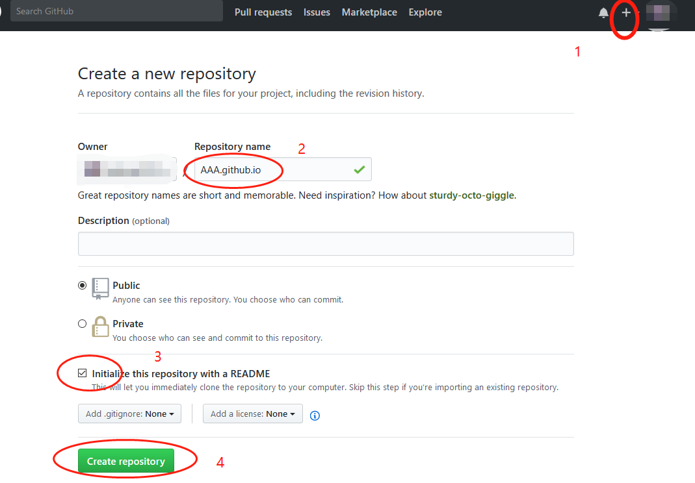
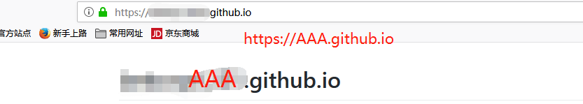

网上学习搭建hexo博客的教程一抓一大把，但是基本上都没说清楚这中间的原理到底是啥？那么让我带领大家一起去探个究竟，学习之前，我们先看看 Github Pages (以下简称 gp) 和 Hexo 到底是什么？

## 1. 什么是Github Pages?

[官方文档](https://help.github.com/articles/what-is-github-pages/)是这样描述的：

`GitHub Pages is a static site hosting service designed to host your personal, organization, or project pages directly from a GitHub repository.`

好了，文档看完了，接下来可以愉快的创建一个属于自己的博客了，我先假设：你已经有了GitHub的账号，并且账号是 `AAA`，

首先 我们创建一个 名称为 `AAA.github.io` (名称必须按这个格式)的git仓库，如下图： 

然后，在浏览器中输入 `http://AAA.github.io` 

看到如上界面，说明我们的最简单的 github博客已经搭建完成啦~~~~

## 2. 什么是 Hexo?

Hexo 是一个快速、简洁且高效的博客框架。Hexo 使用 [Markdown](http://daringfireball.net/projects/markdown/)（或其他渲染引擎）解析文章，在几秒内，即可利用靓丽的主题生成静态网页。

官方文档 [点这查看](https://hexo.io/zh-cn/docs/index.html)

看到这里，可能还是一脸懵逼，不过我们需要知道 gp 和 hexo 之间的联系，在我看来, 他们之间其实没有任何关系，唯一的联系是：

> github 会托管静态网页，而 hexo 会生成静态网页，我们只是将hexo生成的网页放到 github上，这样访问AAA.github.io 就访问了hexo生成的网页

这下子关系一下子就清楚了，接下来继续。。

## 3. 环境 [Node.js](http://nodejs.org/) / [Git](http://git-scm.com/) 安装

来到这步，说明你已经了解了上述的概念

主要流程：

> 1) 安装 git
> 2) 安装node
> 3) node安装好之后，安装hexo

安装细节的话，我们还是按照[官方文档](https://hexo.io/zh-cn/docs/index.html)进行

## 坑：

1.执行 npm install -g hexo-cli 报错

$ npm install -g hexo-cli
npm ERR! code EAI_AGAIN
npm ERR! errno EAI_AGAIN
npm ERR! request to https://registry.npmjs.org/hexo-cli failed, reason: getaddrinfo EAI_AGAIN registry.npmjs.org:443

npm ERR! A complete log of this run can be found in:
npm ERR!     C:\Users\lanbing\AppData\Roaming\npm-cache\_logs\2018-03-13T02_15_13_203Z-debug.log

解决办法：执行  `$ npm install -g npm ` 更新npm,  然后再次执行 `$ npm install -g hexo-cli` 

lanbing@Android MINGW64 ~/Desktop
$ npm install -g npm
C:\Users\lanbing\AppData\Roaming\npm\npm -> C:\Users\lanbing\AppData\Roaming\npm\node_modules\npm\bin\npm-cli.js
C:\Users\lanbing\AppData\Roaming\npm\npx -> C:\Users\lanbing\AppData\Roaming\npm\node_modules\npm\bin\npx-cli.js
npm@5.7.1
added 533 packages in 113.185s

$ npm install -g hexo-cli
C:\Users\lanbing\AppData\Roaming\npm\hexo -> C:\Users\lanbing\AppData\Roaming\npm\node_modules\hexo-cli\bin\hexo
npm WARN optional SKIPPING OPTIONAL DEPENDENCY: fsevents@1.1.3 (node_modules\hexo-cli\node_modules\fsevents):
npm WARN notsup SKIPPING OPTIONAL DEPENDENCY: Unsupported platform for fsevents@1.1.3: wanted {"os":"darwin","arch":"any"} (current: {"os":"win32","arch":"x64"})
hexo-cli@1.1.0
added 103 packages from 338 contributors in 73.08s

2.服务访问不了

