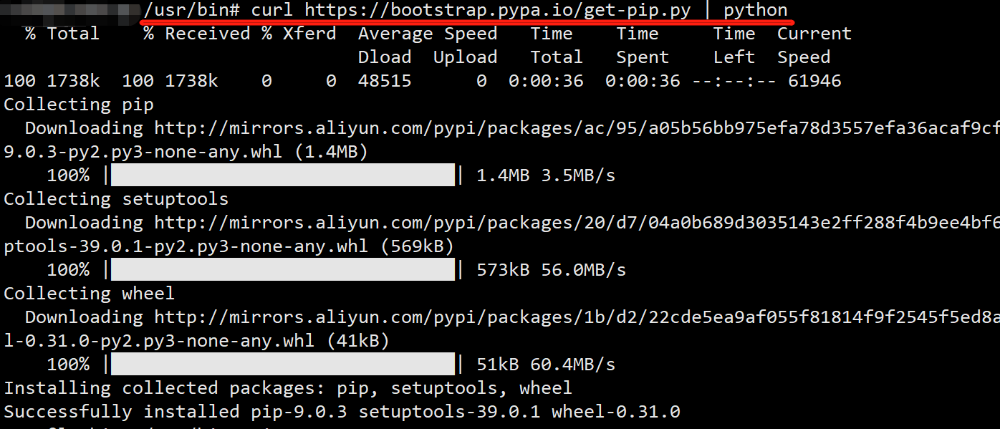
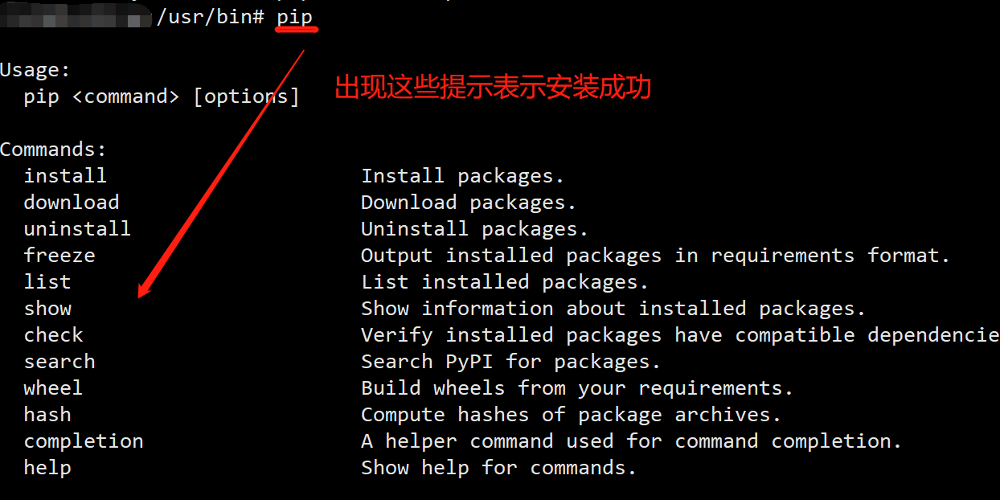
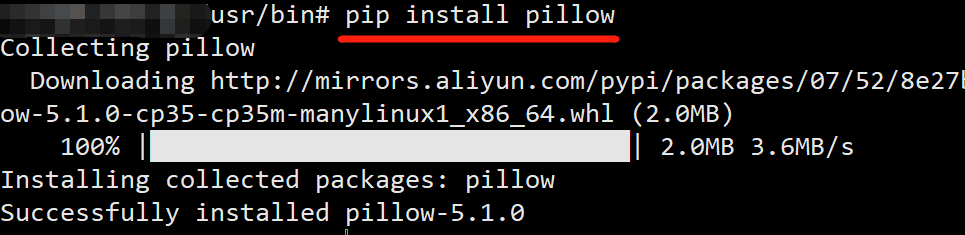

##  通过python中提供的 get-pip.py 文件进行安装：
```
get-pip.py地址：https://bootstrap.pypa.io/get-pip.py

安装命令： curl https://bootstrap.pypa.io/get-pip.py | python
```

1. 按下图进行安装



2. 安装成功后，输入pip命令，出现下图提示，即安装成功



3. 通过pip安装python包示例：安装pillow，按下图安装即可

   